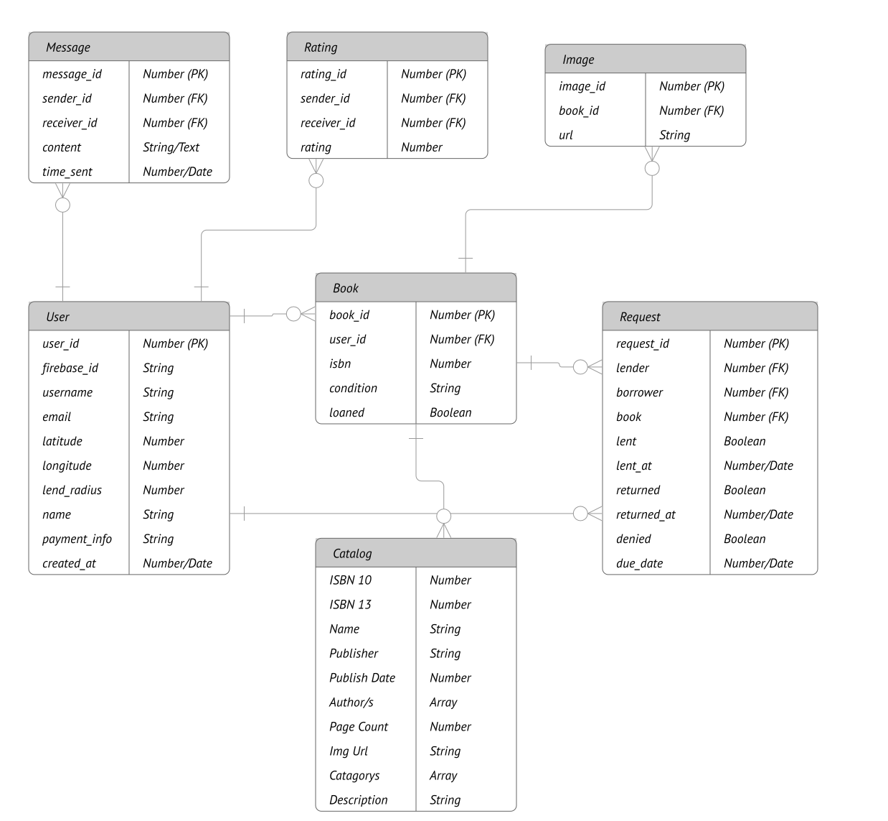

# backend

https://trello.com/b/TaQwsbuj/labsce1-neighborhood-library

https://balsamiq.cloud/snv27r3/p8o4zbq/r491A

https://docs.google.com/document/d/13qdfx7pjijavs49KniYm3qUEaG9B7Tx7o4C2tUhlAUM/edit

🚫 Note: All lines that start with 🚫 are instructions and should be deleted before this is posted to your portfolio. This is intended to be a guideline. Feel free to add your own flare to it.

🚫 The numbers 1️⃣ through 3️⃣ next to each item represent the week that part of the docs needs to be comepleted by. Make sure to delete the numbers by the end of Labs.

🚫 Each student has a required minimum number of meaningful PRs each week per the rubric. Contributing to docs does NOT count as a PR to meet your weekly requirements.

# API Documentation

#### 1️⃣ Backend delpoyed at [🚫name service here](🚫add URL here) <br>

## 1️⃣ Getting started

To get the server running locally:

🚫 adjust these scripts to match your project

- Clone this repo
- **yarn install** to install all required dependencies
- **yarn server** to start the local server
- **yarn test** to start server using testing environment

### Backend framework goes here

🚫 Why did you choose this framework?

- Point One
- Point Two
- Point Three
- Point Four

## Endpoints

#### Book Routes

| Method | Endpoint             | Access Control | Description                                     |
| ------ | -------------------- | -------------- | ----------------------------------------------- |
| GET    | `/book/all`          | All users      | Returns array of all book objects, or empty     |
| GET    | `/book/:id`          | All users      | Returns array containing book object, or empty  |
| GET    | `/book/by-user/:id`  | All users      | Returns array of all books by user id, or empty |
| POST   | `/book/post-new/:id` | User with id   | Returns array containing newly added book       |
| PUT    | `/book/update/:id`   | User with id   | Returns array containing updated book object    |
| DELETE | `/book/delete/:id`   | User with id   | Returns number of rows deleted                  |
| POST  | `/users/`                               | All users       | Creates new user |
| GET   | `/users/id/:user_id`                    | Admin           | Finds user by user_id |
| GET   | `/users/username/:username`             | Admin           | Finds user by username |
| GET   | `/users/firebase_id/:firebase_id`       | Admin           | Finds user by firebase_id |
| GET   | `/users/email/:email`                   | Admin           | Finds user by email |
| GET   | `/users/book_id/:book_id`               | Admin           | finds user by book_id |
| PUT   | `/users/:user_id`                       | All users       | Updates user |
| GET   | `/users/location/:latitude/:longitude`  | Admin           | Gets list of users that have their location at that latitude and longitude |


# Data Model



#### 2️⃣ BOOKS

---

```
{
  user_id: UUID, references user_table
  isbn: STRING
  condition: ENU ("excellent", "very good", "good", "okay", "poor")
  loan: BOOLEAN
  created_at: TIMESTAMP
  updated_at: TIMESTAMP
}
```

#### USERS

---

```
{
  user_id: UUID
  firebase_id: STRING
  username: STRING
  email: STRING
  name: STRING
  latitude: FLOAT
  longitude: FLOAT
  lend_radius: INTEGER
  created_at: TIMESTAMP
  updated_at: TIMESTAMP
  payment_info: STRING
}
```

## 2️⃣ Actions

🚫 This is an example, replace this with the actions that pertain to your backend

`getOrgs()` -> Returns all organizations

`getOrg(orgId)` -> Returns a single organization by ID

`addOrg(org)` -> Returns the created org

`updateOrg(orgId)` -> Update an organization by ID

`deleteOrg(orgId)` -> Delete an organization by ID
<br>
<br>
<br>
`getUsers(orgId)` -> if no param all users

`getUser(userId)` -> Returns a single user by user ID

`addUser(user object)` --> Creates a new user and returns that user. Also creates 7 availabilities defaulted to hours of operation for their organization.

`updateUser(userId, changes object)` -> Updates a single user by ID.

`deleteUser(userId)` -> deletes everything dependent on the user

## 3️⃣ Environment Variables

In order for the app to function correctly, the user must set up their own environment variables.

create a .env file that includes the following:

🚫 These are just examples, replace them with the specifics for your app

_ STAGING_DB - optional development db for using functionality not available in SQLite
_ NODE\*ENV - set to "development" until ready for "production"

- JWT*SECRET - you can generate this by using a python shell and running import random''.join([random.SystemRandom().choice('abcdefghijklmnopqrstuvwxyz0123456789!@#\$%^&amp;*(-_=+)') for i in range(50)])
  _ SENDGRID_API_KEY - this is generated in your Sendgrid account \* stripe_secret - this is generated in the Stripe dashboard

## Contributing

When contributing to this repository, please first discuss the change you wish to make via issue, email, or any other method with the owners of this repository before making a change.

Please note we have a [code of conduct](./code_of_conduct.md). Please follow it in all your interactions with the project.

### Issue/Bug Request

**If you are having an issue with the existing project code, please submit a bug report under the following guidelines:**

- Check first to see if your issue has already been reported.
- Check to see if the issue has recently been fixed by attempting to reproduce the issue using the latest master branch in the repository.
- Create a live example of the problem.
- Submit a detailed bug report including your environment & browser, steps to reproduce the issue, actual and expected outcomes, where you believe the issue is originating from, and any potential solutions you have considered.

### Feature Requests

We would love to hear from you about new features which would improve this app and further the aims of our project. Please provide as much detail and information as possible to show us why you think your new feature should be implemented.

### Pull Requests

If you have developed a patch, bug fix, or new feature that would improve this app, please submit a pull request. It is best to communicate your ideas with the developers first before investing a great deal of time into a pull request to ensure that it will mesh smoothly with the project.

Remember that this project is licensed under the MIT license, and by submitting a pull request, you agree that your work will be, too.

#### Pull Request Guidelines

- Ensure any install or build dependencies are removed before the end of the layer when doing a build.
- Update the README.md with details of changes to the interface, including new plist variables, exposed ports, useful file locations and container parameters.
- Ensure that your code conforms to our existing code conventions and test coverage.
- Include the relevant issue number, if applicable.
- You may merge the Pull Request in once you have the sign-off of two other developers, or if you do not have permission to do that, you may request the second reviewer to merge it for you.

### Attribution

These contribution guidelines have been adapted from [this good-Contributing.md-template](https://gist.github.com/PurpleBooth/b24679402957c63ec426).

## Documentation

See [Frontend Documentation](🚫link to your frontend readme here) for details on the fronend of our project.
🚫 Add DS iOS and/or Andriod links here if applicable.
